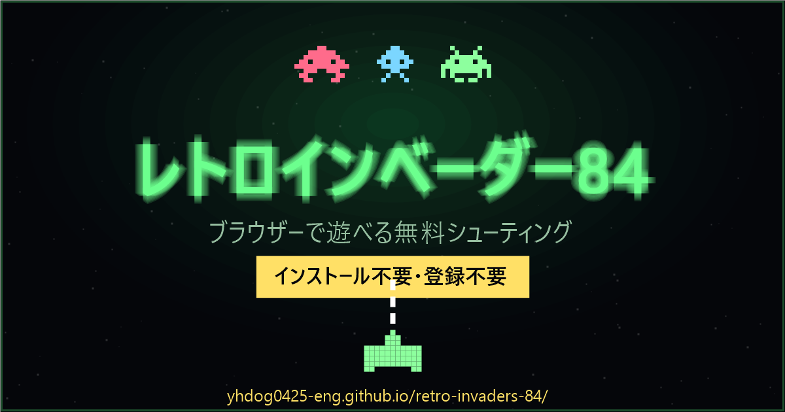

# レトロインベーダー84 / RETRO INVADERS 84

80年代アーケード風のドットシューティングです。**インストール不要・登録不要**、ブラウザーを開くだけで遊べます。

### ▶ [今すぐあそぶ](https://yhdog0425-eng.github.io/retro-invaders-84/)

`https://yhdog0425-eng.github.io/retro-invaders-84/`

---

## 遊び方

| 操作 | PC | スマホ・タブレット |
|---|---|---|
| 移動 | `←` `→`（`A` `D` も可） | 画面下の ◀ ▶ ボタン |
| 発射 | `SPACE` | 画面下の「撃つ」ボタン |
| 一時停止 | `P` | — |
| 音のON・OFF | `M` | — |

### ルール

- インベーダーを全滅させると次のレベルへ。レベルが上がるほど初速・弾数・爆弾の頻度が上がります
- 残りのインベーダーが減るほど**移動が速くなります**
- 得点は種類ごとに **10点 / 20点 / 30点**
- ときどき現れるピンクの **UFO は 50〜300点** のボーナス
- 緑のシールドは盾になりますが、**自分の弾でも削れます**。撃つ場所を選んでください
- インベーダーが地上に到達したらゲームオーバー。残機は3機
- ハイスコアはブラウザーに自動保存されます（`localStorage`）

## 特別なURLパラメーター

| URL | 動作 |
|---|---|
| `index.html?demo=1` | CPUが自動でプレイするデモモード。動画収録やイベント展示向け |
| `index.html?rec=1` | 周辺のUIを消して画面を最大化する録画モード |
| `index.html?demo=1&rec=1` | 上記の組み合わせ。そのまま流しっぱなしにできます |
| `shorts.html` | ショート動画（1080×1920）収録用の縦フレーム |

タイトル画面を20秒放置すると、自動的にデモプレイが始まります（アトラクトモード）。何かキーを押すかタップすると自分のプレイに切り替わります。

## 技術的なこと

- **HTML1ファイル完結**。ビルド不要、依存ライブラリなし、外部通信なし
- 描画は Canvas 2D。ドット絵は文字列で定義したビットマップを `fillRect` で描いています
- 効果音は **Web Audio API でその場で合成**（音声ファイルを一切持ちません）
- データ保存はハイスコアのみ。サーバーへの送信は行いません

## 権利について

本作は、クラシックアーケードゲームに**インスパイアされたオリジナル作品**です。

- ドット絵・効果音・プログラムはすべて本プロジェクトで新規に制作したものです
- 既存商用ゲームの画像・音声・コードは一切使用していません
- 「スペースインベーダー」は株式会社タイトーの登録商標であり、本作とは無関係です

## ライセンス

[MIT License](LICENSE) — 自由に読み、改造し、再配布していただけます。
